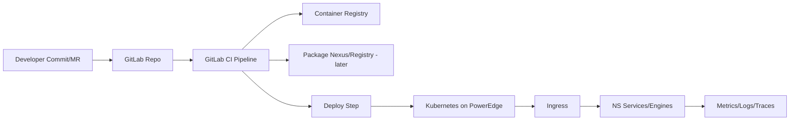

# NS-CICD-000 — GitLab CI/CD Standing Runbook (Repo → Build → Deploy)

## 0. Purpose

Define the standing, repeatable CI/CD approach for Northfield Solidarity (NS):

*   Source in GitLab
*   Containerize consistently
*   Push to registry
*   Deploy to Kubernetes on PowerEdge
*   Support multiple environments (dev/stage/prod)
*   Enable safe rollback + traceability

This is written as a runbook + reference standard.

## 1. Target End-to-End Flow



Core principles:

*   Every deploy is tied to a git SHA
*   Images are immutable (tag by SHA)
*   Promotion is explicit (dev → stage → prod)
*   Rollback is one command

## 2. Repo Standards

### 2.1 Standard layout (suggested)

```text
repo/
  app/                    # service code
  Dockerfile
  .gitlab-ci.yml
  deploy/
    helm/                 # charts per service or mono-chart
    kustomize/            # optional alternative
    env/
      dev.values.yaml
      stage.values.yaml
      prod.values.yaml
```

### 2.2 Required endpoints for every service

*   `GET /healthz` (liveness)
*   `GET /readyz` (readiness)
*   `GET /metrics` (Prometheus)

## 3. Containerization Standard

### 3.1 Image tagging

*   Primary tag: `$CI_COMMIT_SHA`
*   Optional human tags:
    *   `main-latest` (only for convenience)
    *   release tags: `vX.Y.Z`

### 3.2 Base image + hardening

*   Use minimal runtime images where possible
*   Run as non-root in containers
*   Expose only required ports

### 3.3 Build engine

*   Prefer BuildKit for speed
*   Prefer multi-stage Dockerfiles

## 4. GitLab Runners

### 4.1 Runner placement options

**Option A — Runner on the PowerEdge (fast MVP)**

*   Easy to control
*   Good for early-stage

**Option B — Runner in Kubernetes (scale later)**

*   Scales with cluster
*   Requires stable cluster + runner chart

### 4.2 Runner executors

*   Docker executor (common)
*   Kubernetes executor (later)

## 5. Registry Strategy

### 5.1 Images

*   Use GitLab Container Registry initially
*   Names: `$CI_REGISTRY_IMAGE/service-name:$CI_COMMIT_SHA`

### 5.2 Packages (later)

*   Add a package nexus (Nexus/Artifactory/GitLab Packages)
*   Proxy caches for pip/npm/conan

## 6. Kubernetes Deployment Strategy

You standardize one of these:

### 6.1 Helm (recommended)

*   `helm upgrade --install`
*   values per environment
*   rollback built-in

### 6.2 Kustomize (fine)

*   overlays per environment
*   strong for GitOps

### 6.3 GitOps (later)

*   Argo CD or Flux
*   CI updates manifests; cluster reconciles

## 7. Cluster Access from GitLab

### 7.1 Preferred: GitLab Kubernetes Agent

**Pros:**
*   no kubeconfig secrets in CI
*   clean audit trail

### 7.2 Quick: Service account kubeconfig in CI Variables

**Pros:**
*   fastest to bootstrap

**Cons:**
*   secret management burden

**MVP recommendation:**
*   start with kubeconfig if you need speed today
*   migrate to Agent once stable

## 8. Environment Model

### 8.1 Namespaces

*   `ns-dev`
*   `ns-stage`
*   `ns-prod`

### 8.2 Promotion

*   dev deploy on merge to main (or MR)
*   stage deploy manual / on tag
*   prod deploy manual with approval

## 9. GitLab CI/CD Variables (Canonical)

Store as masked protected variables in GitLab.

### 9.1 Registry

*   `CI_REGISTRY`, `CI_REGISTRY_USER`, `CI_REGISTRY_PASSWORD` (GitLab provides)

### 9.2 Kubernetes (if using kubeconfig approach)

*   `KUBE_CONFIG_DEV` (base64 kubeconfig)
*   `KUBE_CONFIG_STAGE`
*   `KUBE_CONFIG_PROD`

### 9.3 App secrets

*   Prefer external secrets later; MVP can use GitLab variables injected to Helm values.

## 10. Canonical Pipeline: Build → Push → Deploy

Below is a template; you copy into each service repo and adjust.

### 10.1 .gitlab-ci.yml (template)

```yaml
stages: [lint, test, build, deploy]

variables:
  IMAGE_TAG: $CI_COMMIT_SHA
  IMAGE: $CI_REGISTRY_IMAGE:$IMAGE_TAG

# --- Lint/Test (language-specific) ---
lint:
  stage: lint
  image: alpine:latest
  script:
    - echo "Add ruff/pytest/cmake lint here"

test:
  stage: test
  image: alpine:latest
  script:
    - echo "Add unit tests here"

# --- Build & Push image ---
build:
  stage: build
  image: docker:27
  services:
    - docker:27-dind
  variables:
    DOCKER_TLS_CERTDIR: ""
  script:
    - docker login -u "$CI_REGISTRY_USER" -p "$CI_REGISTRY_PASSWORD" "$CI_REGISTRY"
    - docker build -t "$IMAGE" .
    - docker push "$IMAGE"
  rules:
    - if: $CI_COMMIT_BRANCH

# --- Deploy (Helm) ---
deploy_dev:
  stage: deploy
  image: alpine/helm:3.15.0
  script:
    - echo "$KUBE_CONFIG_DEV" | base64 -d > kubeconfig
    - export KUBECONFIG=$PWD/kubeconfig
    - kubectl create namespace ns-dev --dry-run=client -o yaml | kubectl apply -f -
    - helm upgrade --install ns-service ./deploy/helm \
        --namespace ns-dev \
        -f ./deploy/env/dev.values.yaml \
        --set image.repository="$CI_REGISTRY_IMAGE" \
        --set image.tag="$IMAGE_TAG"
  rules:
    - if: $CI_COMMIT_BRANCH == "main"

# stage/prod are typically manual gated
deploy_stage:
  stage: deploy
  image: alpine/helm:3.15.0
  script:
    - echo "$KUBE_CONFIG_STAGE" | base64 -d > kubeconfig
    - export KUBECONFIG=$PWD/kubeconfig
    - kubectl create namespace ns-stage --dry-run=client -o yaml | kubectl apply -f -
    - helm upgrade --install ns-service ./deploy/helm \
        --namespace ns-stage \
        -f ./deploy/env/stage.values.yaml \
        --set image.repository="$CI_REGISTRY_IMAGE" \
        --set image.tag="$IMAGE_TAG"
  when: manual
  rules:
    - if: $CI_COMMIT_BRANCH == "main"

deploy_prod:
  stage: deploy
  image: alpine/helm:3.15.0
  script:
    - echo "$KUBE_CONFIG_PROD" | base64 -d > kubeconfig
    - export KUBECONFIG=$PWD/kubeconfig
    - kubectl create namespace ns-prod --dry-run=client -o yaml | kubectl apply -f -
    - helm upgrade --install ns-service ./deploy/helm \
        --namespace ns-prod \
        -f ./deploy/env/prod.values.yaml \
        --set image.repository="$CI_REGISTRY_IMAGE" \
        --set image.tag="$IMAGE_TAG"
  when: manual
  rules:
    - if: $CI_COMMIT_TAG
```

**Notes:**

*   Dev deploy on main merge.
*   Prod deploy on tag (manual) or protected branch.

## 11. Helm Chart Minimums (per service)

Your `deploy/helm` chart must define:

*   Deployment
*   Service
*   Ingress (optional per env)
*   ConfigMap/Secret usage
*   Resource requests/limits
*   Liveness/Readiness probes

**Minimum probe example:**

```yaml
liveness: /healthz
readiness: /readyz
```

## 12. Validation Commands (Operator)

### 12.1 Cluster and namespace

```bash
kubectl get nodes
kubectl get ns
kubectl -n ns-dev get pods
```

### 12.2 Rollout health

```bash
kubectl -n ns-dev rollout status deploy/ns-service
kubectl -n ns-dev describe pod <pod>
kubectl -n ns-dev logs deploy/ns-service --tail=200
```

### 12.3 Helm

```bash
helm -n ns-dev list
helm -n ns-dev history ns-service
```

## 13. Rollback Procedure

### 13.1 Helm rollback

```bash
helm -n ns-dev history ns-service
helm -n ns-dev rollback ns-service <REVISION>
```

### 13.2 Re-deploy a prior image

redeploy with `--set image.tag=<SHA>`

## 14. Security & Governance Controls

Minimum controls:

*   protected branches for prod
*   required MR approvals
*   SAST/Dependency scans (GitLab features)
*   container image scanning
*   SBOM generation (later)

## 15. Operational Cadence

*   **Daily:** check pipeline failures + cluster health
*   **Weekly:** prune unused images and old deployments
*   **Monthly:** test rollback, test restore

## 16. Next Documents

*   [NS-CICD-001 — GitLab Runner Install (PowerEdge)](./NS-CICD-001-GL-RUNNER-INSTALL.md)
*   [NS-CICD-002 — Kubernetes Bootstrap (k3s + Ingress + Storage)](./NS-CICD-002-KUBERNETES.md)
*   [NS-CICD-003 — GitLab Agent Setup (preferred access model)](./NS-CICD-003-GL-DEPLOY-INTEGRATION.md)
*   [NS-CICD-004 — On-server Package Nexus (pip/conan/npm proxy)](./NS-CICD-004-HELM-CHART.md)
