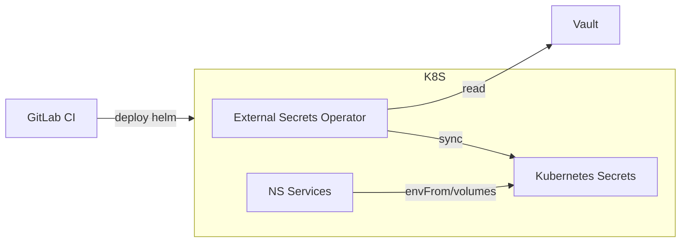

# NS-CICD-005 — External Secrets + Vault (Week 2 Implementation)

## 0. Purpose

Implement External Secrets + HashiCorp Vault so runtime secrets are not managed via GitLab variables/Kubernetes Secret manifests.

End state:

*   Vault is the system-of-record for secrets
*   External Secrets Operator (ESO) syncs Vault → Kubernetes Secrets
*   Helm deployments reference Kubernetes Secrets (no plaintext in CI)
*   Rotation becomes a Vault operation + rollout

## 1. Target Architecture



Key principles:

*   CI deploys code/config only (no secret material)
*   Vault auth uses Kubernetes Auth (service accounts)
*   ESO has its own Vault role/policy

## 2. Deployment Model

### 2.1 MVP (Week 2) vs Production-grade

**Week 2 MVP recommended:**

*   Vault inside Kubernetes
*   Integrated Storage (Raft)
*   1 replica acceptable on single-node k3s

**Production-grade later:**

*   Vault HA (3 replicas) + raft
*   Auto-unseal via KMS/HSM (cloud or on-prem HSM)
*   Separate node pool, network policies, TLS everywhere

## 3. Namespaces

Create a dedicated namespace:

`ns-secrets`

```bash
kubectl create namespace ns-secrets || true
```

## 4. Install Vault (Helm)

### 4.1 Add HashiCorp Helm repo

```bash
helm repo add hashicorp https://helm.releases.hashicorp.com
helm repo update
```

### 4.2 Minimal values for single-node Raft (MVP)

Create `vault.values.yaml`:

```yaml
server:
  enabled: true
  standalone:
    enabled: false
  ha:
    enabled: true
    replicas: 1
    raft:
      enabled: true
      setNodeId: true
  dataStorage:
    enabled: true
    size: 20Gi
  auditStorage:
    enabled: true
    size: 10Gi

ui:
  enabled: true

injector:
  enabled: false
```

Install:

```bash
helm upgrade --install vault hashicorp/vault \
  -n ns-secrets \
  -f vault.values.yaml
```

Verify:

```bash
kubectl -n ns-secrets get pods
kubectl -n ns-secrets get svc
```

## 5. Initialize + Unseal Vault

This is the “operator ceremony.” For MVP you can do it manually; later add auto-unseal.

Exec into the Vault pod:

```bash
kubectl -n ns-secrets exec -it deploy/vault -- sh
```

Initialize:

```bash
vault operator init
```

You will receive:

*   unseal keys (store securely)
*   initial root token (store securely)

Unseal:

```bash
vault operator unseal
# repeat with required number of keys
```

Login (root token):

```bash
vault login
```

**Minimum operations standard:**

*   store unseal keys + root token in an offline password manager + backup
*   do not leave root token in shell history

## 6. Enable Kubernetes Auth in Vault

### 6.1 Create Vault service account token reviewer

Vault needs to verify k8s service account JWTs.

Create `vault-auth-sa.yaml`:

```yaml
apiVersion: v1
kind: ServiceAccount
metadata:
  name: vault-auth
  namespace: ns-secrets
---
apiVersion: rbac.authorization.k8s.io/v1
kind: ClusterRoleBinding
metadata:
  name: vault-auth-tokenreview
subjects:
  - kind: ServiceAccount
    name: vault-auth
    namespace: ns-secrets
roleRef:
  apiGroup: rbac.authorization.k8s.io
  kind: ClusterRole
  name: system:auth-delegator
```

Apply:

```bash
kubectl apply -f vault-auth-sa.yaml
```

### 6.2 Configure Vault Kubernetes Auth

Inside the vault pod:

```bash
vault auth enable kubernetes
```

Gather cluster info:

```bash
K8S_HOST="https://kubernetes.default.svc"
K8S_CA_CERT=$(cat /var/run/secrets/kubernetes.io/serviceaccount/ca.crt)
TOKEN_REVIEW_JWT=$(cat /var/run/secrets/kubernetes.io/serviceaccount/token)
```

Configure:

```bash
vault write auth/kubernetes/config \
  kubernetes_host="$K8S_HOST" \
  kubernetes_ca_cert="$K8S_CA_CERT" \
  token_reviewer_jwt="$TOKEN_REVIEW_JWT"
```

## 7. Vault Secret Engine + Policy

### 7.1 Enable KV v2

```bash
vault secrets enable -path=kv kv-v2
```

### 7.2 Write a sample secret

```bash
vault kv put kv/ns/dev/hello POSTGRES_URL="postgres://..." JWT_SIGNING_KEY="..."
```

### 7.3 Create a policy for ESO

Create `eso-policy.hcl`:

```hcl
path "kv/data/ns/dev/*" {
  capabilities = ["read"]
}

path "kv/metadata/ns/dev/*" {
  capabilities = ["read", "list"]
}
```

Apply:

```bash
vault policy write eso-dev eso-policy.hcl
```

## 8. Vault Role for External Secrets Operator

ESO will authenticate to Vault using a Kubernetes ServiceAccount.

### 8.1 Create ESO namespace + SA

```bash
kubectl create namespace external-secrets || true
kubectl -n external-secrets create serviceaccount eso-vault || true
```

### 8.2 Create a Vault role bound to that SA

```bash
vault write auth/kubernetes/role/eso-dev \
  bound_service_account_names=eso-vault \
  bound_service_account_namespaces=external-secrets \
  policies=eso-dev \
  ttl=24h
```

## 9. Install External Secrets Operator (ESO)

### 9.1 Install via Helm

```bash
helm repo add external-secrets https://charts.external-secrets.io
helm repo update

helm upgrade --install external-secrets external-secrets/external-secrets \
  -n external-secrets \
  --create-namespace
```

Verify:

```bash
kubectl -n external-secrets get pods
```

## 10. Connect ESO to Vault

Use a `ClusterSecretStore` so multiple namespaces can reuse it.

Create `vault-clustersecretstore.yaml`:

```yaml
apiVersion: external-secrets.io/v1beta1
kind: ClusterSecretStore
metadata:
  name: vault-store
spec:
  provider:
    vault:
      server: "http://vault.ns-secrets.svc.cluster.local:8200"
      path: "kv"
      version: "v2"
      auth:
        kubernetes:
          mountPath: "kubernetes"
          role: "eso-dev"
          serviceAccountRef:
            name: "eso-vault"
            namespace: "external-secrets"
```

Apply:

```bash
kubectl apply -f vault-clustersecretstore.yaml
```

## 11. Define ExternalSecret (per service, per namespace)

Example: sync a Vault secret to `ns-dev`.

Create `hello-externalsecret.yaml`:

```yaml
apiVersion: external-secrets.io/v1beta1
kind: ExternalSecret
metadata:
  name: ns-hello-secret
  namespace: ns-dev
spec:
  refreshInterval: 1h
  secretStoreRef:
    name: vault-store
    kind: ClusterSecretStore
  target:
    name: ns-hello-secret
    creationPolicy: Owner
  data:
    - secretKey: POSTGRES_URL
      remoteRef:
        key: ns/dev/hello
        property: POSTGRES_URL
    - secretKey: JWT_SIGNING_KEY
      remoteRef:
        key: ns/dev/hello
        property: JWT_SIGNING_KEY
```

Apply:

```bash
kubectl apply -f hello-externalsecret.yaml
kubectl -n ns-dev get externalsecret
kubectl -n ns-dev get secret ns-hello-secret
```

## 12. Update Helm Charts to Use Synced Secrets

In your service Helm values (dev/stage/prod):

```yaml
envFrom:
  - secretRef:
      name: ns-hello-secret
```

**Important:**

*   With ESO, you typically set `secret.enabled=false` in Helm
*   Helm does not manage the secret content; ESO does

## 13. GitLab CI Changes

Once ESO is in place:

*   remove `--set-string secret.data.*` from deploy jobs
*   deploy jobs only set image repo/tag + non-secret config

Your CI becomes safer and simpler.

## 14. Rotation Workflow (Vault + ESO)

1.  Update secret in Vault
2.  ESO refresh picks it up (or force refresh by deleting ExternalSecret/secret)
3.  Restart rollout (if app doesn’t hot-reload env vars)

Force rollout:

```bash
kubectl -n ns-dev rollout restart deploy/<name>
```

## 15. Hardening Checklist (Do After MVP Works)

*   Put Vault behind TLS (Ingress + cert-manager)
*   Restrict Vault service to cluster-only (NetworkPolicy)
*   Enable audit logging in Vault
*   Remove root token from daily use; create operator/admin policies
*   Move to 3-node Vault HA + second PowerEdge
*   Auto-unseal (preferred)

## 16. “Done” Criteria

You are complete when:

*   a service in `ns-dev` reads secrets via `envFrom` from an ESO-managed Secret
*   CI deploy contains zero secret material
*   Vault policy/role is least-privileged

## 17. Next Docs

*   [NS-CICD-010 — Vault HA on 2 PowerEdges (Raft replication + failure modes)](./NS-CICD-010A-ALERT-RULES.md) (Note: verify link target)
*   [NS-CICD-011 — TLS Standard for Vault + Ingress (cert-manager)](./NS-CICD-006-TLS-STANDARD.md)
*   NS-CICD-012 — Secret Taxonomy per Engine (GGP/DRE/SIG/etc.)
