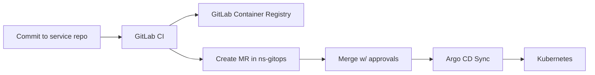

# NS-CICD-008B — GitLab → GitOps Promotion Pipeline (MR Automation + Approvals)

## 0. Purpose

Define the standing CI pattern where GitLab builds images and then promotes deployments by updating the GitOps repo (consumed by Argo CD).

End state:

*   Service repos never need kubeconfig to deploy
*   Argo CD deploys by reconciling Git
*   Promotion is controlled through Merge Requests + approvals
*   Rollback is a git revert

## 1. Canonical Flow



## 2. Repos and Responsibilities

### 2.1 Service repo (e.g., ns-ggp)

**Owns:**

*   code
*   Dockerfile
*   Helm chart (or chart in a shared charts repo)

**Produces:**

*   image tags (SHA, release tag)

### 2.2 GitOps repo (e.g., ns-gitops)

**Owns:**

*   Argo CD Applications
*   environment values (dev/stage/prod)
*   ExternalSecret manifests (safe)

**Consumes:**

*   image tag updates from service pipeline

## 3. Promotion Strategy (NS Standard)

### 3.1 Dev

*   Automatic promotion on merge to main (service repo)
*   CI updates `ns-gitops` dev values

### 3.2 Stage

*   Manual or scheduled promotion
*   CI creates MR targeting stage values

### 3.3 Prod

*   Tag-based release (e.g., `v1.2.3`)
*   CI creates MR updating prod values to the tag
*   Merge requires approvals + protected branch rules

## 4. Auth Model (Bot User / Token)

### 4.1 Recommended

Use a GitLab bot user (or service account) with:

*   write access to `ns-gitops`
*   permission to create branches + MRs

**Token options:**

*   Personal Access Token (PAT) for the bot user
*   Project access token (if supported for MR operations in your setup)

**Security rules:**

*   store token as masked + protected CI variable
*   scope token to the smallest required permissions

## 5. GitOps Repo Layout Assumption

This pipeline assumes:

*   `ns-gitops/services/<service>/values/dev.yaml`
*   `ns-gitops/services/<service>/values/stage.yaml`
*   `ns-gitops/services/<service>/values/prod.yaml`

And the values file contains:

```yaml
image:
  repository: registry.gitlab.com/<group>/<service>
  tag: <sha-or-release>
```

## 6. Variables (Canonical)

Set these CI variables in the service repo (or group-level):

*   `GITOPS_PROJECT_PATH` = `group/ns-gitops`
*   `GITOPS_DEFAULT_BRANCH` = `main`
*   `GITOPS_TOKEN` = bot token (masked/protected)

**Optional:**

*   `GITOPS_BASE_URL` (if self-hosted GitLab)

**Environment-specific:**

*   `PROMOTE_ENV` (dev/stage/prod) when you want manual triggers

## 7. Tooling for YAML Edits

Use `yq` to safely edit YAML values.

Standard container image for promotion jobs:

`alpine` + `git` + `yq` + `curl`

## 8. Service Repo Pipeline Template

### 8.1 Build image (standard)

*   Tag image with `$CI_COMMIT_SHA`
*   Push to GitLab registry

### 8.2 Promote to GitOps by MR

1.  Create a branch in `ns-gitops`
2.  Update the appropriate values file
3.  Push branch
4.  Create MR via GitLab API

## 9. Reference Implementation (Copy/Paste)

### 9.1 `.gitlab-ci.yml` (service repo) — Build + Promote Dev

```yaml
stages: [build, promote]

variables:
  IMAGE_TAG: $CI_COMMIT_SHA
  IMAGE: $CI_REGISTRY_IMAGE:$IMAGE_TAG

build:
  stage: build
  tags: [poweredge]
  image: docker:27
  services: [docker:27-dind]
  variables:
    DOCKER_TLS_CERTDIR: ""
  script:
    - docker login -u "$CI_REGISTRY_USER" -p "$CI_REGISTRY_PASSWORD" "$CI_REGISTRY"
    - docker build -t "$IMAGE" .
    - docker push "$IMAGE"
  rules:
    - if: $CI_COMMIT_BRANCH

promote_dev:
  stage: promote
  image: alpine:3.20
  tags: [poweredge]
  before_script:
    - apk add --no-cache git curl yq
  script:
    - ./ci/promote-gitops.sh dev "$CI_REGISTRY_IMAGE" "$CI_COMMIT_SHA"
  rules:
    - if: $CI_COMMIT_BRANCH == "main"
```

### 9.2 `ci/promote-gitops.sh` (service repo)

```bash
#!/usr/bin/env sh
set -eu

ENV="$1"            # dev|stage|prod
IMAGE_REPO="$2"      # e.g., registry.gitlab.com/group/ns-ggp
IMAGE_TAG="$3"       # sha or release tag

: "${GITOPS_PROJECT_PATH:?Missing GITOPS_PROJECT_PATH}"
: "${GITOPS_DEFAULT_BRANCH:?Missing GITOPS_DEFAULT_BRANCH}"
: "${GITOPS_TOKEN:?Missing GITOPS_TOKEN}"

# GitLab.com base; if self-hosted, set GITOPS_BASE_URL
BASE_URL="${GITOPS_BASE_URL:-https://gitlab.com}"

# Construct authenticated clone URL
# NOTE: Some orgs prefer using a bot user + token in HTTPS.
CLONE_URL="$BASE_URL/${GITOPS_PROJECT_PATH}.git"

BRANCH="promote/${CI_PROJECT_NAME}/${ENV}/${CI_COMMIT_SHORT_SHA}"

rm -rf /tmp/ns-gitops
mkdir -p /tmp/ns-gitops
cd /tmp/ns-gitops

# Use token for clone
git -c http.extraHeader="PRIVATE-TOKEN: $GITOPS_TOKEN" clone "$CLONE_URL" .

git checkout "$GITOPS_DEFAULT_BRANCH"
git checkout -b "$BRANCH"

VALUES_PATH="services/${CI_PROJECT_NAME}/values/${ENV}.yaml"

# Ensure file exists
if [ ! -f "$VALUES_PATH" ]; then
  echo "Missing values file: $VALUES_PATH" >&2
  exit 1
fi

# Update YAML
yq -i ".image.repository = \"$IMAGE_REPO\"" "$VALUES_PATH"
yq -i ".image.tag = \"$IMAGE_TAG\"" "$VALUES_PATH"

git status

git add "$VALUES_PATH"
git commit -m "promote(${CI_PROJECT_NAME}): ${ENV} -> ${IMAGE_TAG}"

# Push using token
git -c http.extraHeader="PRIVATE-TOKEN: $GITOPS_TOKEN" push -u origin "$BRANCH"

# Create MR via API
# You can also skip MR for dev and push directly, but MR keeps audit consistent.
TITLE="promote ${CI_PROJECT_NAME} ${ENV} to ${IMAGE_TAG}"

curl -sS -X POST \
  -H "PRIVATE-TOKEN: $GITOPS_TOKEN" \
  "$BASE_URL/api/v4/projects/$(python3 - <<'PY'
import urllib.parse, os
print(urllib.parse.quote_plus(os.environ['GITOPS_PROJECT_PATH']))
PY
)/merge_requests" \
  --data-urlencode "source_branch=$BRANCH" \
  --data-urlencode "target_branch=$GITOPS_DEFAULT_BRANCH" \
  --data-urlencode "title=$TITLE" \
  --data-urlencode "remove_source_branch=true" \
  > /dev/null

echo "Created MR for $ENV promotion."
```

If you don’t want python available, you can hardcode the project ID instead of URL-encoding `GITOPS_PROJECT_PATH`.

## 10. Prod Release Pattern (Tag-based)

In `.gitlab-ci.yml`:

```yaml
promote_prod:
  stage: promote
  image: alpine:3.20
  tags: [poweredge]
  before_script:
    - apk add --no-cache git curl yq
  script:
    - ./ci/promote-gitops.sh prod "$CI_REGISTRY_IMAGE" "$CI_COMMIT_TAG"
  when: manual
  rules:
    - if: $CI_COMMIT_TAG
```

**Rules:**

*   prod promotions only occur on tags
*   MR merge requires approvals

## 11. Approval and Guardrail Standard

### 11.1 GitOps repo branch protections

*   protect `main`
*   require approvals for changes under:
    *   `services/**/values/prod.yaml`
    *   `clusters/**`

### 11.2 CODEOWNERS

Add `CODEOWNERS` in `ns-gitops`:

*   platform team owns `clusters/` and `platform/`
*   service owners own `services/<service>/`
*   security/ops owns `services/**/values/prod.yaml`

### 11.3 Environments

If you use GitLab Environments:

*   tie prod promote job to a protected environment
*   require deploy approvals

## 12. Rollback Standard

Rollback is a git revert in `ns-gitops`:

1.  revert the commit that changed the `image.tag`
2.  Argo CD reconciles back

## 13. Common Failure Modes

*   **MR not created:** token lacks api scope or project permissions
*   **YAML not updated:** values file path mismatch
*   **Argo doesn’t deploy:** Application points to wrong path/branch
*   **Image pull fails:** registry creds / `imagePullSecrets` not set in namespace

## 14. Next Enhancements

*   Add Argo CD Image Updater (optional)
*   Add semantic release automation (tagging + changelog)
*   Add policy checks (OPA/Conftest) on GitOps repo MRs
*   Add progressive delivery (Argo Rollouts) for canaries
