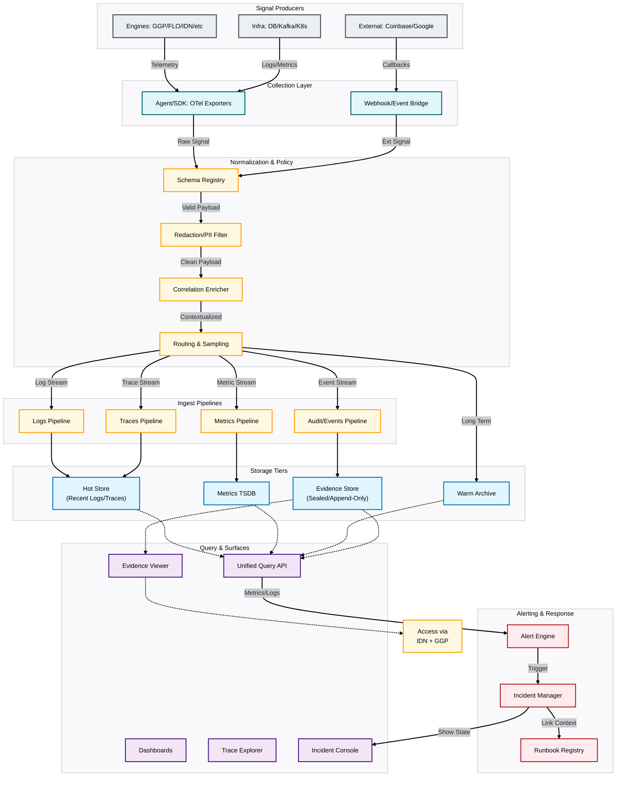

# LUM Internal Architecture Diagram

```mermaid
---
    config:
      theme: redux
---
graph TD
    %% -- Styles --
    classDef intake fill:#e0f7fa,stroke:#006064,stroke-width:2px,color:#000000;
    classDef logic fill:#fff8e1,stroke:#ffa000,stroke-width:2px,color:#000000;
    classDef store fill:#e1f5fe,stroke:#0277bd,stroke-width:2px,color:#000000;
    classDef serve fill:#f3e5f5,stroke:#4a148c,stroke-width:2px,color:#000000;
    classDef action fill:#ffebee,stroke:#b71c1c,stroke-width:2px,color:#000000;
    classDef producer fill:#eceff1,stroke:#37474f,stroke-width:2px,color:#000000;

    %% -- 1. Signal Producers --
    subgraph Producers [Signal Producers]
        Engines["Engines: GGP/FLO/IDN/etc"]:::producer
        Infra["Infra: DB/Kafka/K8s"]:::producer
        External["External: Coinbase/Google"]:::producer
    end 

    %% -- 2. Collection Layer --
    subgraph Collect [Collection Layer]
        Agent["Agent/SDK: OTel Exporters"]:::intake
        Webhook["Webhook/Event Bridge"]:::intake
    end

    %% -- 3. Normalization & Policy --
    subgraph Normalize [Normalization & Policy]
        SchemaReg["Schema Registry"]:::logic
        Redactor["Redaction/PII Filter"]:::logic
        Enricher["Correlation Enricher"]:::logic
        Router["Routing & Sampling"]:::logic
    end

    %% -- 4. Ingest Pipelines --
    subgraph Pipelines [Ingest Pipelines]
        PLog["Logs Pipeline"]:::logic
        PMetric["Metrics Pipeline"]:::logic
        PTrace["Traces Pipeline"]:::logic
        PAudit["Audit/Events Pipeline"]:::logic
    end

    %% -- 5. Storage Tiers --
    subgraph Stores [Storage Tiers]
        HotStore["Hot Store<br/>(Recent Logs/Traces)"]:::store
        MetricStore["Metrics TSDB"]:::store
        WarmStore["Warm Archive"]:::store
        EvStore["Evidence Store<br/>(Sealed/Append-Only)"]:::store
    end

    %% -- 6. Query & Surfaces --
    subgraph Serve [Query & Surfaces]
        QueryAPI["Unified Query API"]:::serve
        Dashboard["Dashboards"]:::serve
        TraceExp["Trace Explorer"]:::serve
        IncConsole["Incident Console"]:::serve
        EvViewer["Evidence Viewer"]:::serve
    end

    %% -- 7. Alerting & Response --
    subgraph Action [Alerting & Response]
        AlertEng["Alert Engine"]:::action
        IncMgr["Incident Manager"]:::action
        RunbookReg["Runbook Registry"]:::action
    end

    %% -- Data Flow --
    
    %% Produce -> Collect
    Engines -->|"Telemetry"| Agent
    Infra -->|"Logs/Metrics"| Agent
    External -->|"Callbacks"| Webhook

    %% Collect -> Normalize
    Agent -->|"Raw Signal"| SchemaReg
    Webhook -->|"Ext Signal"| SchemaReg
    SchemaReg -->|"Valid Payload"| Redactor
    Redactor -->|"Clean Payload"| Enricher
    Enricher -->|"Contextualized"| Router

    %% Normalize -> Pipelines
    Router -->|"Log Stream"| PLog
    Router -->|"Metric Stream"| PMetric
    Router -->|"Trace Stream"| PTrace
    Router -->|"Event Stream"| PAudit

    %% Pipelines -> Stores
    PLog --> HotStore
    PMetric --> MetricStore
    PTrace --> HotStore
    PAudit --> EvStore
    Router -->|"Long Term"| WarmStore

    %% Stores -> Serve
    HotStore -.-> QueryAPI
    MetricStore -.-> QueryAPI
    WarmStore -.-> QueryAPI
    EvStore -.-> EvViewer
    EvStore -.-> QueryAPI

    %% Serve -> Action
    QueryAPI -->|"Metrics/Logs"| AlertEng
    AlertEng -->|"Trigger"| IncMgr
    IncMgr -->|"Link Context"| RunbookReg

    %% Action Feedback
    IncMgr -->|"Show State"| IncConsole

    %% Governance & Access (Notes)
    EvViewer -.-> AccessPolicy["Access via<br/>IDN + GGP"]:::logic
```
