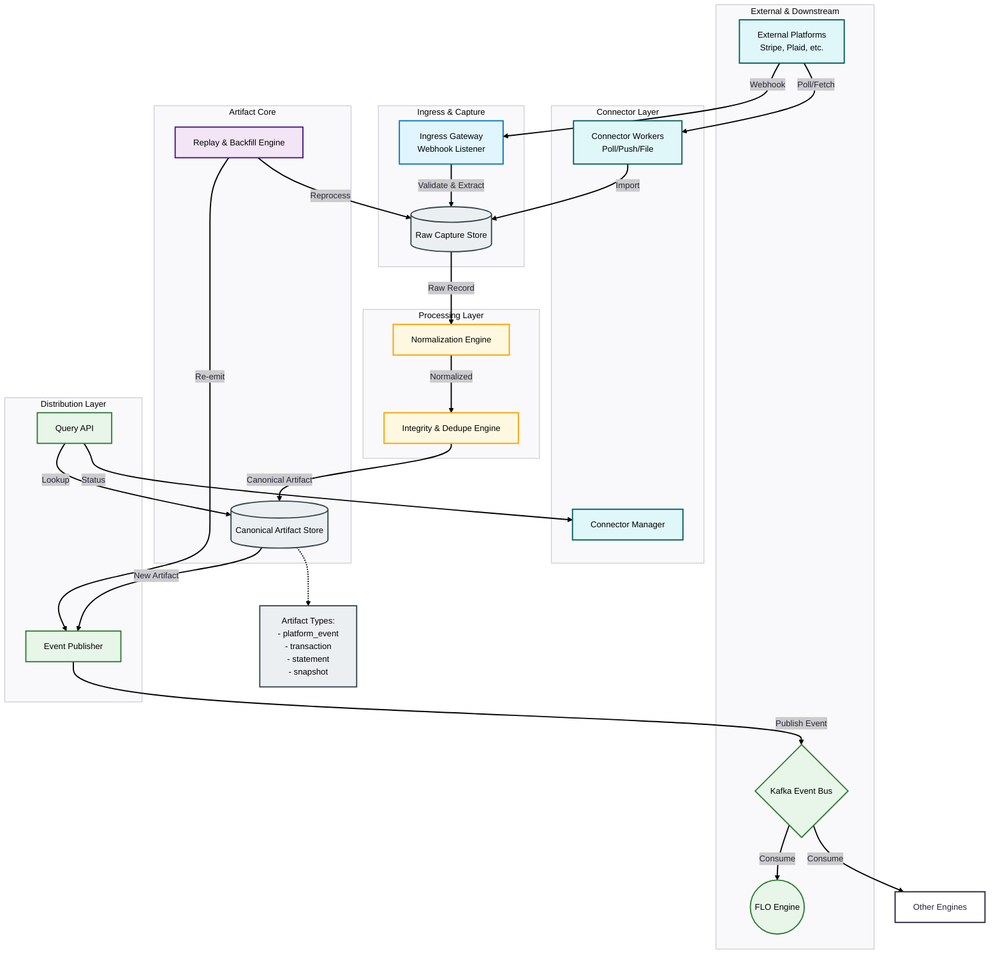

# MUX Internal Architecture Diagram

```mermaid
---
    config:
      theme: redux
---
graph TD
    %% -- Styles --
    classDef conn fill:#e0f7fa,stroke:#006064,stroke-width:2px,color:#000000;
    classDef ingest fill:#e1f5fe,stroke:#0277bd,stroke-width:2px,color:#000000;
    classDef logic fill:#fff8e1,stroke:#ffa000,stroke-width:2px,color:#000000;
    classDef core fill:#f3e5f5,stroke:#4a148c,stroke-width:2px,color:#000000;
    classDef db fill:#eceff1,stroke:#37474f,stroke-width:2px,color:#000000;
    classDef dist fill:#e8f5e9,stroke:#2e7d32,stroke-width:2px,color:#000000;

    %% -- 1. Connector Layer --
    subgraph Connectors ["Connector Layer"]
        ConnMgr["Connector Manager"]:::conn
        Worker["Connector Workers<br/>Poll/Push/File"]:::conn
    end

    %% -- 2. Ingress & Capture --
    subgraph Ingress ["Ingress & Capture"]
        IngressGW["Ingress Gateway<br/>Webhook Listener"]:::ingest
        CaptureStore[("Raw Capture Store")]:::db
    end

    %% -- 3. Normalization & Integrity --
    subgraph Processing ["Processing Layer"]
        Normalizer["Normalization Engine"]:::logic
        Integrity["Integrity & Dedupe Engine"]:::logic
    end

    %% -- 4. Artifact & Replay --
    subgraph Core ["Artifact Core"]
        ArtifactStore[("Canonical Artifact Store")]:::db
        ReplayEng["Replay & Backfill Engine"]:::core
    end

    %% -- 5. Distribution --
    subgraph Dist ["Distribution Layer"]
        Publisher["Event Publisher"]:::dist
        QueryAPI["Query API"]:::dist
    end

    %% -- External Systems --
    subgraph External ["External & Downstream"]
        ExtSys["External Platforms<br/>Stripe, Plaid, etc."]:::conn
        Kafka{"Kafka Event Bus"}:::dist
        FLO(("FLO Engine")):::dist
    end

    %% -- Data Flow --

    %% Ingress Flow (Webhook)
    ExtSys -- "Webhook" --> IngressGW
    IngressGW -- "Validate & Extract" --> CaptureStore

    %% Ingress Flow (Worker)
    ExtSys -- "Poll/Fetch" --> Worker
    Worker -- "Import" --> CaptureStore

    %% Processing
    CaptureStore -- "Raw Record" --> Normalizer
    Normalizer -- "Normalized" --> Integrity
    Integrity -- "Canonical Artifact" --> ArtifactStore

    %% Distribution
    ArtifactStore -- "New Artifact" --> Publisher
    Publisher -- "Publish Event" --> Kafka
    
    %% Replay
    ReplayEng -- "Reprocess" --> CaptureStore
    ReplayEng -- "Re-emit" --> Publisher

    %% Query
    QueryAPI -- "Lookup" --> ArtifactStore
    QueryAPI -- "Status" --> ConnMgr

    %% Downstream
    Kafka -- "Consume" --> FLO
    Kafka -- "Consume" --> OtherEngines["Other Engines"]

    %% Detailed Models (Notes)
    ArtifactStore -.-> Models["Artifact Types:<br/>- platform_event<br/>- transaction<br/>- statement<br/>- snapshot"]:::db
```
