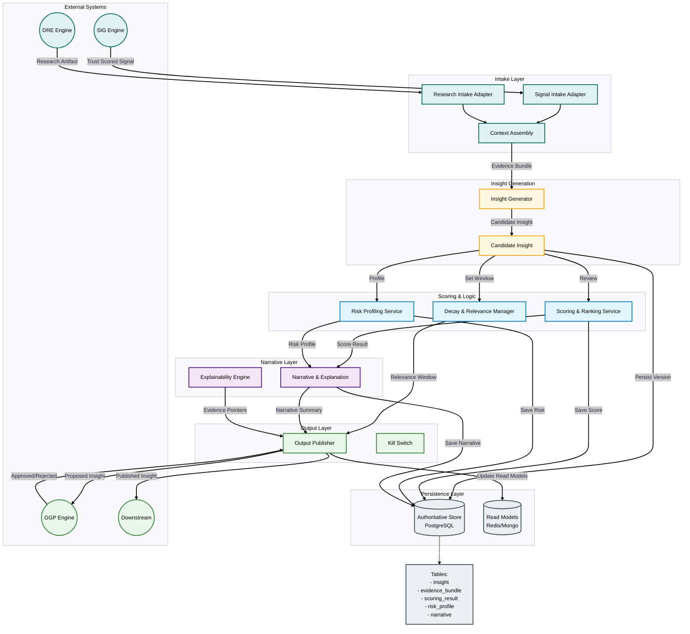

# PIE Internal Architecture Diagram

```mermaid
---
    config:
      theme: redux
---
graph TD
    %% -- Styles --
    classDef intake fill:#e0f2f1,stroke:#00695c,stroke-width:2px,color:#000000;
    classDef logic fill:#fff8e1,stroke:#ffa000,stroke-width:2px,color:#000000;
    classDef score fill:#e1f5fe,stroke:#0277bd,stroke-width:2px,color:#000000;
    classDef text fill:#f3e5f5,stroke:#4a148c,stroke-width:2px,color:#000000;
    classDef output fill:#e8f5e9,stroke:#2e7d32,stroke-width:2px,color:#000000;
    classDef db fill:#eceff1,stroke:#37474f,stroke-width:2px,color:#000000;

    %% -- 1. Intake Layer --
    subgraph Intake [Intake Layer]
        SigAdapter[Signal Intake Adapter]:::intake
        DreAdapter[Research Intake Adapter]:::intake
        ContextAssembly[Context Assembly]:::intake
    end

    %% -- 2. Insight Generation --
    subgraph Gen [Insight Generation]
        InsightGen[Insight Generator]:::logic
        CandidateInsight[Candidate Insight]:::logic
    end

    %% -- 3. Scoring & Logic --
    subgraph Scoring [Scoring & Logic]
        ScoringSvc[Scoring & Ranking Service]:::score
        RiskSvc[Risk Profiling Service]:::score
        DecayMgr[Decay & Relevance Manager]:::score
    end

    %% -- 4. Narrative Synthesis --
    subgraph Narrative [Narrative Layer]
        NarrativeGen[Narrative & Explanation]:::text
        Explainability[Explainability Engine]:::text
    end

    %% -- 5. Output & Control --
    subgraph Output [Output Layer]
        Publisher[Output Publisher]:::output
        KillSwitch[Kill Switch]:::output
    end

    %% -- Data Persistence --
    subgraph Storage [Persistence Layer]
        PG[(Authoritative Store<br/>PostgreSQL)]:::db
        ReadModels[(Read Models<br/>Redis/Mongo)]:::db
    end

    %% -- External Integrations --
    subgraph External [External Systems]
        SIG((SIG Engine)):::intake
        DRE((DRE Engine)):::intake
        GGP((GGP Engine)):::output
        Consumer((Downstream)):::output
    end

    %% -- Data Flow --

    %% Intake
    SIG -- "Trust Scored Signal" --> SigAdapter
    DRE -- "Research Artifact" --> DreAdapter
    SigAdapter --> ContextAssembly
    DreAdapter --> ContextAssembly
    ContextAssembly -- "Evidence Bundle" --> InsightGen

    %% Generation
    InsightGen -- "Candidate Insight" --> CandidateInsight
    CandidateInsight -- "Persist Version" --> PG

    %% Analysis Loop
    CandidateInsight -- "Review" --> ScoringSvc
    CandidateInsight -- "Profile" --> RiskSvc
    CandidateInsight -- "Set Window" --> DecayMgr

    ScoringSvc -- "Score Result" --> NarrativeGen
    RiskSvc -- "Risk Profile" --> NarrativeGen
    DecayMgr -- "Relevance Window" --> Publisher

    %% Narrative
    NarrativeGen -- "Narrative Summary" --> Publisher
    Explainability -- "Evidence Pointers" --> Publisher

    %% Storage
    ScoringSvc -- "Save Score" --> PG
    RiskSvc -- "Save Risk" --> PG
    NarrativeGen -- "Save Narrative" --> PG
    Publisher -- "Update Read Models" --> ReadModels

    %% Output
    Publisher -- "Proposed Insight" --> GGP
    GGP -- "Approved/Rejected" --> Publisher
    Publisher -- "Published Insight" --> Consumer

    %% Detailed Models (Notes)
    PG -.-> PGModels["Tables:<br/>- insight<br/>- evidence_bundle<br/>- scoring_result<br/>- risk_profile<br/>- narrative"]:::db
```
