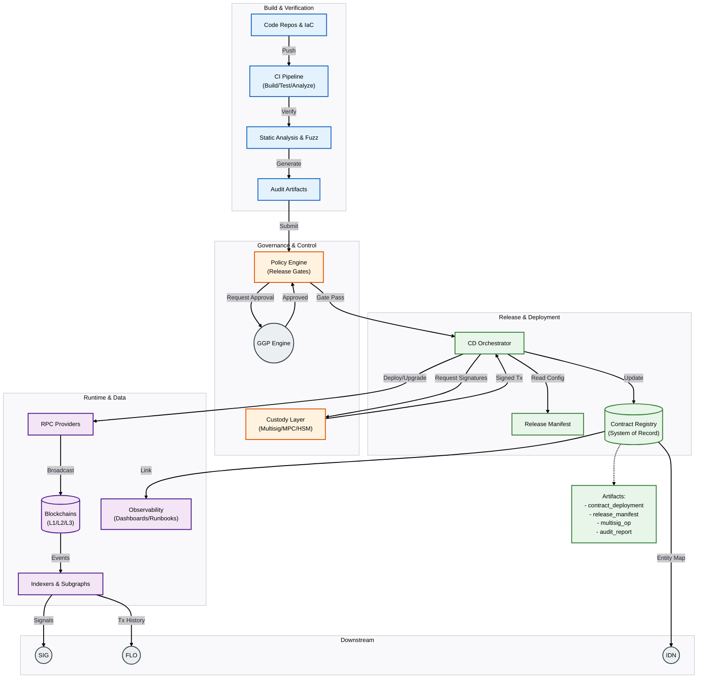

# BCP Internal Architecture Diagram

```mermaid
---
    config:
      theme: redux
---
graph TD
    %% -- Styles --
    classDef build fill:#e3f2fd,stroke:#1565c0,stroke-width:2px,color:#000000;
    classDef release fill:#e8f5e9,stroke:#2e7d32,stroke-width:2px,color:#000000;
    classDef gov fill:#fff3e0,stroke:#e65100,stroke-width:2px,color:#000000;
    classDef runtime fill:#f3e5f5,stroke:#4a148c,stroke-width:2px,color:#000000;
    classDef ext fill:#eceff1,stroke:#37474f,stroke-width:2px,color:#000000;

    %% -- 1. Build & Verification Plane --
    subgraph Build ["Build & Verification"]
        Repo["Code Repos & IaC"]:::build
        CI["CI Pipeline<br/>(Build/Test/Analyze)"]:::build
        Analysis["Static Analysis & Fuzz"]:::build
        Artifacts["Audit Artifacts"]:::build
    end

    %% -- 2. Governance & Control Plane --
    subgraph Governance ["Governance & Control"]
        PolicyEng["Policy Engine<br/>(Release Gates)"]:::gov
        Custody["Custody Layer<br/>(Multisig/MPC/HSM)"]:::gov
        GGP((GGP Engine)):::ext
    end

    %% -- 3. Release & Deployment Plane --
    subgraph Release ["Release & Deployment"]
        ReleaseOrch["CD Orchestrator"]:::release
        Manifest["Release Manifest"]:::release
        Registry[("Contract Registry<br/>(System of Record)")]:::release
    end

    %% -- 4. Runtime & Data Plane --
    subgraph Runtime ["Runtime & Data"]
        RPC["RPC Providers"]:::runtime
        Chain[("Blockchains<br/>(L1/L2/L3)")]:::runtime
        Indexer["Indexers & Subgraphs"]:::runtime
        Obs["Observability<br/>(Dashboards/Runbooks)"]:::runtime
    end

    %% -- External Consumers --
    subgraph External ["Downstream"]
        SIG((SIG)):::ext
        FLO((FLO)):::ext
        IDN((IDN)):::ext
    end

    %% -- Data Flow --

    %% Build Phase
    Repo -- "Push" --> CI
    CI -- "Verify" --> Analysis
    Analysis -- "Generate" --> Artifacts
    Artifacts -- "Submit" --> PolicyEng

    %% Governance Phase
    PolicyEng -- "Request Approval" --> GGP
    GGP -- "Approved" --> PolicyEng
    PolicyEng -- "Gate Pass" --> ReleaseOrch
    ReleaseOrch -- "Request Signatures" --> Custody
    Custody -- "Signed Tx" --> ReleaseOrch

    %% Deployment Phase
    ReleaseOrch -- "Read Config" --> Manifest
    ReleaseOrch -- "Deploy/Upgrade" --> RPC
    RPC -- "Broadcast" --> Chain
    
    %% Post-Deploy
    ReleaseOrch -- "Update" --> Registry
    Registry -- "Link" --> Obs

    %% Runtime Data
    Chain -- "Events" --> Indexer
    Indexer -- "Signals" --> SIG
    Indexer -- "Tx History" --> FLO
    Registry -- "Entity Map" --> IDN

    %% Detailed Models (Notes)
    Registry -.-> Models["Artifacts:<br/>- contract_deployment<br/>- release_manifest<br/>- multisig_op<br/>- audit_report"]:::release
```
