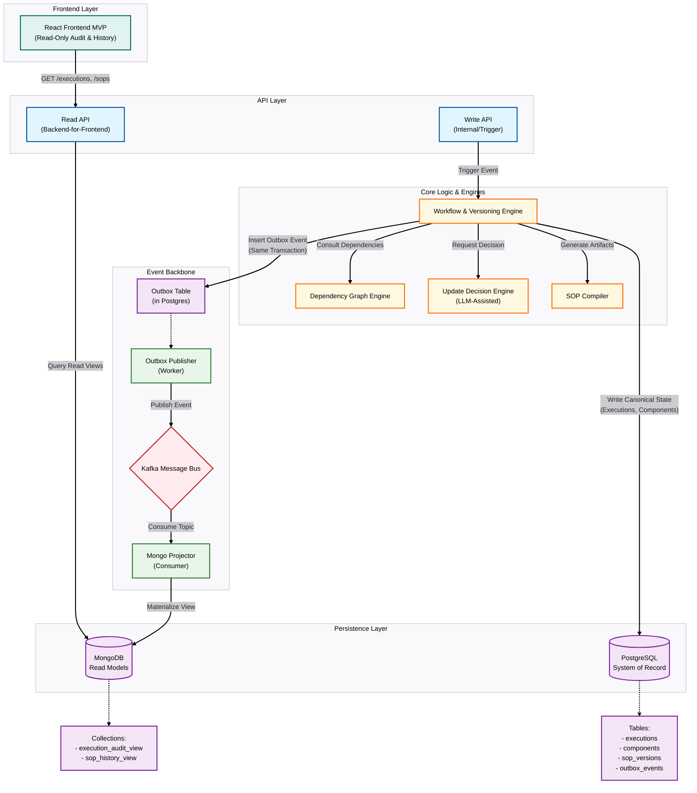

```mermaid
---
    config:
      theme: redux
---
flowchart TB
 subgraph FE["Frontend Layer"]
        UI["React Frontend MVP\n(Read-Only Audit & History)"]
  end
 subgraph API["API Layer"]
        ReadAPI["Read API\n(Backend-for-Frontend)"]
        WriteAPI["Write API\n(Internal/Trigger)"]
  end
 subgraph Core["Core Logic & Engines"]
        DGE["Dependency Graph Engine"]
        UDE["Update Decision Engine\n(LLM-Assisted)"]
        WVE["Workflow & Versioning Engine"]
        SOPC["SOP Compiler"]
  end
 subgraph Storage["Persistence Layer"]
        PG[("PostgreSQL\nSystem of Record")]
        Mongo[("MongoDB\nRead Models")]
  end
 subgraph EventBus["Event Backbone"]
        Outbox["Outbox Table\n(in Postgres)"]
        Publisher["Outbox Publisher\n(Worker)"]
        Kafka{"Kafka Message Bus"}
        Projector["Mongo Projector\n(Consumer)"]
  end
    UI -- GET /executions, /sops --> ReadAPI
    ReadAPI -- Query Read Views --> Mongo
    WriteAPI -- Trigger Event --> WVE
    WVE -- Consult Dependencies --> DGE
    WVE -- Request Decision --> UDE
    WVE -- Generate Artifacts --> SOPC
    WVE -- Write Canonical State\n(Executions, Components) --> PG
    WVE -- Insert Outbox Event\n(Same Transaction) --> Outbox
    Outbox -.-> Publisher
    Publisher -- Publish Event --> Kafka
    Kafka -- Consume Topic --> Projector
    Projector -- Materialize View --> Mongo
    PG -.-> PGModels["Tables:\n- executions\n- components\n- sop_versions\n- outbox_events"]
    Mongo -.-> MongoModels["Collections:\n- execution_audit_view\n- sop_history_view"]

     UI:::frontend
     ReadAPI:::api
     WriteAPI:::api
     DGE:::logic
     UDE:::logic
     WVE:::logic
     SOPC:::logic
     PG:::db
     Mongo:::db
     Outbox:::db
     Publisher:::worker
     Kafka:::event
     Projector:::worker
     PGModels:::db
     MongoModels:::db
    classDef frontend fill:#e0f2f1,stroke:#00695c,stroke-width:2px,color:#000000
    classDef api fill:#e1f5fe,stroke:#01579b,stroke-width:2px,color:#000000
    classDef logic fill:#fff8e1,stroke:#ff6f00,stroke-width:2px,color:#000000
    classDef db fill:#f3e5f5,stroke:#7b1fa2,stroke-width:2px,color:#000000
    classDef event fill:#ffebee,stroke:#b71c1c,stroke-width:2px,color:#000000
    classDef worker fill:#e8f5e9,stroke:#2e7d32,stroke-width:2px,color:#000000
```