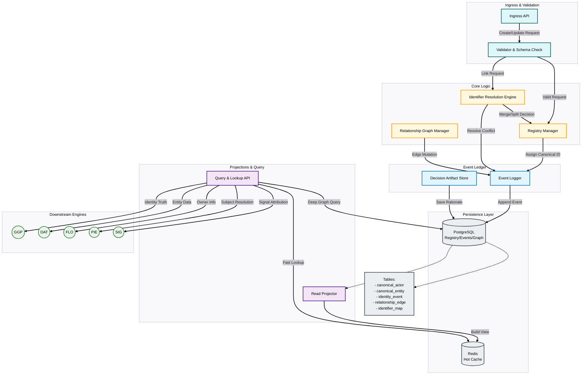

# IDN Internal Architecture Diagram

```mermaid
---
    config:
      theme: redux
---
graph TD
    %% -- Styles --
    classDef intake fill:#e0f7fa,stroke:#006064,stroke-width:2px,color:#000000;
    classDef logic fill:#fff8e1,stroke:#ffa000,stroke-width:2px,color:#000000;
    classDef core fill:#e1f5fe,stroke:#0277bd,stroke-width:2px,color:#000000;
    classDef read fill:#f3e5f5,stroke:#4a148c,stroke-width:2px,color:#000000;
    classDef db fill:#eceff1,stroke:#37474f,stroke-width:2px,color:#000000;
    classDef ext fill:#e8f5e9,stroke:#2e7d32,stroke-width:2px,color:#000000;

    %% -- 1. Ingress & Validation --
    subgraph Ingress [Ingress & Validation]
        API[Ingress API]:::intake
        Validator[Validator & Schema Check]:::intake
    end

    %% -- 2. Core Logic (Resolution & Registry) --
    subgraph CoreLogic [Core Logic]
        Resolver[Identifier Resolution Engine]:::logic
        RegistryMgr[Registry Manager]:::logic
        GraphMgr[Relationship Graph Manager]:::logic
    end

    %% -- 3. Event Ledger Layer --
    subgraph Audit [Event Ledger]
        EventLogger[Event Logger]:::core
        DecisionStore[Decision Artifact Store]:::core
    end

    %% -- 4. Projections & Distribution --
    subgraph Reads [Projections & Query]
        Projector[Read Projector]:::read
        QueryAPI[Query & Lookup API]:::read
    end

    %% -- Persistence --
    subgraph Storage [Persistence Layer]
        PG[(PostgreSQL<br/>Registry/Events/Graph)]:::db
        Redis[(Redis<br/>Hot Cache)]:::db
    end

    %% -- External Consumers --
    subgraph External [Downstream Engines]
        GGP((GGP)):::ext
        DAT((DAT)):::ext
        FLO((FLO)):::ext
        PIE((PIE)):::ext
        SIG((SIG)):::ext
    end

    %% -- Data Flow --

    %% Ingress to Logic
    API -- "Create/Update Request" --> Validator
    Validator -- "Valid Request" --> RegistryMgr
    Validator -- "Link Request" --> Resolver

    %% Logic Processing
    RegistryMgr -- "Assign Canonical ID" --> EventLogger
    Resolver -- "Resolve Conflict" --> EventLogger
    Resolver -- "Merge/Split Decision" --> RegistryMgr
    GraphMgr -- "Edge Mutation" --> EventLogger

    %% Persistence
    EventLogger -- "Append Event" --> PG
    DecisionStore -- "Save Rationale" --> PG
    
    %% Projections
    PG -.-> Projector
    Projector -- "Build View" --> Redis
    
    %% Queries
    QueryAPI -- "Fast Lookup" --> Redis
    QueryAPI -- "Deep Graph Query" --> PG

    %% Downstream
    QueryAPI -- "Identity Truth" --> GGP
    QueryAPI -- "Entity Data" --> DAT
    QueryAPI -- "Owner Info" --> FLO
    QueryAPI -- "Subject Resolution" --> PIE
    QueryAPI -- "Signal Attribution" --> SIG

    %% Detailed Models (Notes)
    PG -.-> PGModels["Tables:<br/>- canonical_actor<br/>- canonical_entity<br/>- identity_event<br/>- relationship_edge<br/>- identifier_map"]:::db
```
