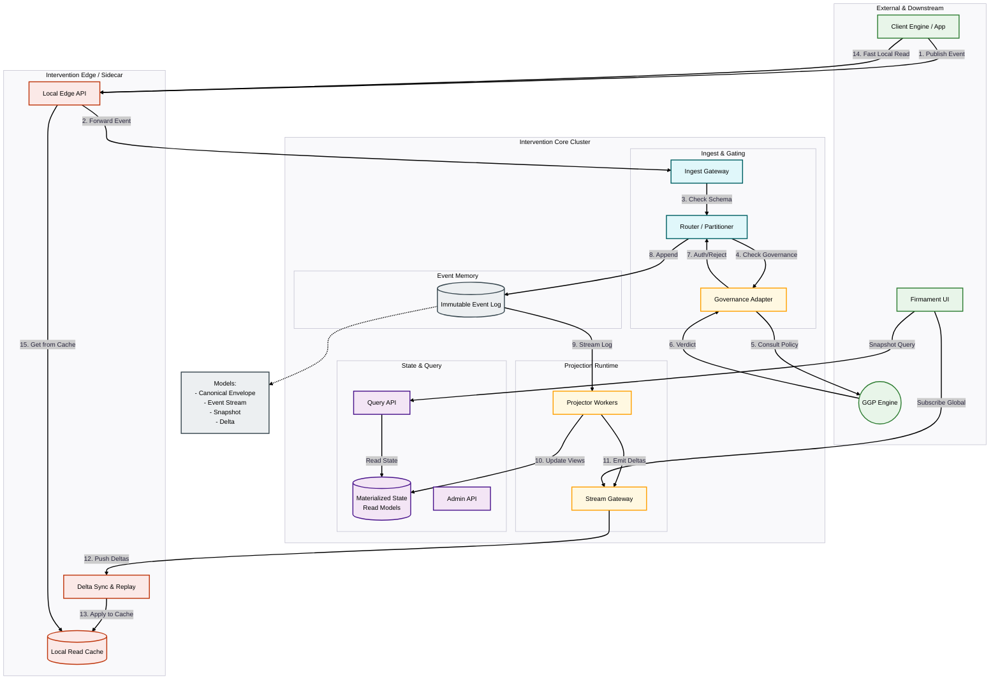

# INT Internal Architecture Diagram

```mermaid
---
    config:
      theme: redux
---
graph TD
    %% -- Styles --
    classDef ingest fill:#e0f7fa,stroke:#006064,stroke-width:2px,color:#000000;
    classDef logic fill:#fff8e1,stroke:#ffa000,stroke-width:2px,color:#000000;
    classDef core fill:#e1f5fe,stroke:#0277bd,stroke-width:2px,color:#000000;
    classDef read fill:#f3e5f5,stroke:#4a148c,stroke-width:2px,color:#000000;
    classDef db fill:#eceff1,stroke:#37474f,stroke-width:2px,color:#000000;
    classDef ext fill:#e8f5e9,stroke:#2e7d32,stroke-width:2px,color:#000000;
    classDef edge fill:#fbe9e7,stroke:#bf360c,stroke-width:2px,color:#000000;

    %% -- 1. Intervention Core --
    subgraph Core [Intervention Core Cluster]
        
        %% Ingest & Gating
        subgraph IngestLayer [Ingest & Gating]
            IngestGW[Ingest Gateway]:::ingest
            Router[Router / Partitioner]:::ingest
            GovAdapter[Governance Adapter]:::logic
        end

        %% Event Persistence
        subgraph EventLayer [Event Memory]
            EventLog[(Immutable Event Log)]:::db
        end

        %% Projections
        subgraph ProjectionLayer [Projection Runtime]
            Projectors[Projector Workers]:::logic
            StreamGW[Stream Gateway]:::logic
        end

        %% Read State
        subgraph ReadLayer [State & Query]
            MatState[(Materialized State<br/>Read Models)]:::read
            QueryAPI[Query API]:::read
            AdminAPI[Admin API]:::read
        end
    end

    %% -- 2. Intervention Edge --
    subgraph Edge [Intervention Edge / Sidecar]
        LocalCache[(Local Read Cache)]:::edge
        SyncLogic[Delta Sync & Replay]:::edge
        EdgeAPI[Local Edge API]:::edge
    end

    %% -- 3. External Connectors --
    subgraph External [External & Downstream]
        GGP((GGP Engine)):::ext
        ClientApp[Client Engine / App]:::ext
        Firmament[Firmament UI]:::ext
    end

    %% -- Data Flow --

    %% Ingestion Flow
    ClientApp -- "1. Publish Event" --> EdgeAPI
    EdgeAPI -- "2. Forward Event" --> IngestGW
    IngestGW -- "3. Check Schema" --> Router
    Router -- "4. Check Governance" --> GovAdapter
    GovAdapter -- "5. Consult Policy" --> GGP
    GGP -- "6. Verdict" --> GovAdapter
    GovAdapter -- "7. Auth/Reject" --> Router
    Router -- "8. Append" --> EventLog

    %% Projection Flow
    EventLog -- "9. Stream Log" --> Projectors
    Projectors -- "10. Update Views" --> MatState
    Projectors -- "11. Emit Deltas" --> StreamGW

    %% Query & Stream Flow
    StreamGW -- "12. Push Deltas" --> SyncLogic
    SyncLogic -- "13. Apply to Cache" --> LocalCache
    ClientApp -- "14. Fast Local Read" --> EdgeAPI
    EdgeAPI -- "15. Get from Cache" --> LocalCache
    
    %% Firmament Flow
    Firmament -- "Subscribe Global" --> StreamGW
    Firmament -- "Snapshot Query" --> QueryAPI
    QueryAPI -- "Read State" --> MatState

    %% Detailed Models (Notes)
    EventLog -.-> Models["Models:<br/>- Canonical Envelope<br/>- Event Stream<br/>- Snapshot<br/>- Delta"]:::db
```
