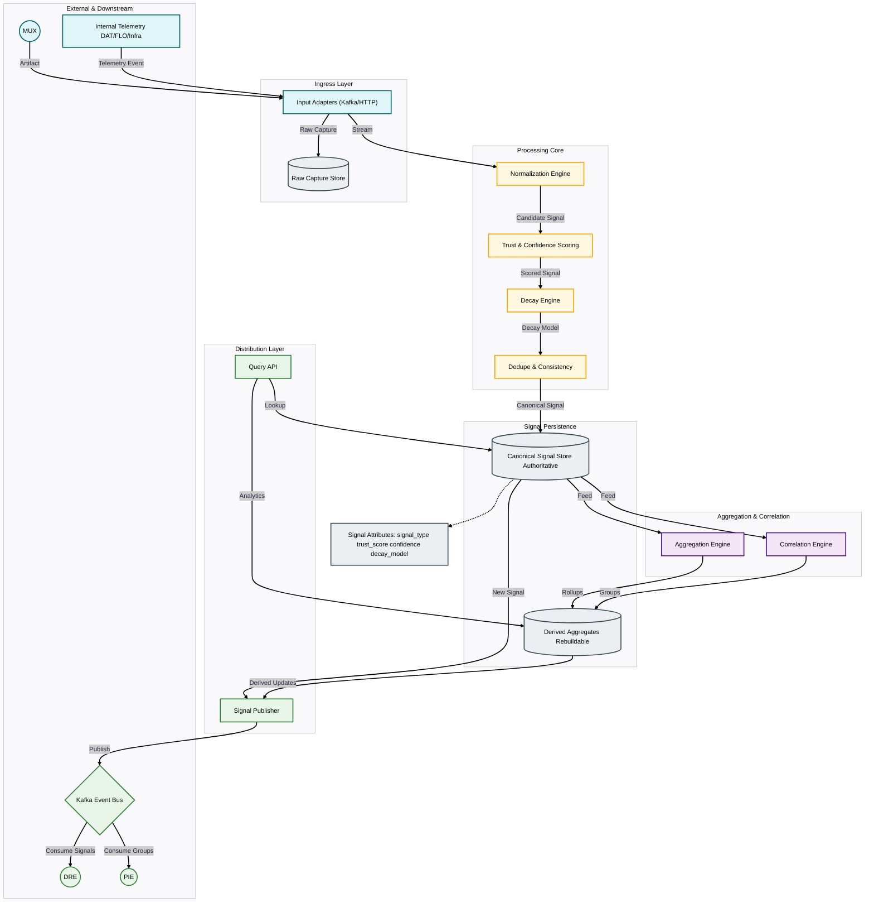

# SIG Internal Architecture Diagram

```mermaid
---
    config:
      theme: redux
---
graph TD
    %% -- Styles --
    classDef input fill:#e0f7fa,stroke:#006064,stroke-width:2px,color:#000000;
    classDef logic fill:#fff8e1,stroke:#ffa000,stroke-width:2px,color:#000000;
    classDef store fill:#eceff1,stroke:#37474f,stroke-width:2px,color:#000000;
    classDef output fill:#e8f5e9,stroke:#2e7d32,stroke-width:2px,color:#000000;
    classDef feedback fill:#f3e5f5,stroke:#4a148c,stroke-width:2px,color:#000000;

    %% -- 1. Ingress Layer --
    subgraph Ingress ["Ingress Layer"]
        Adapters["Input Adapters (Kafka/HTTP)"]:::input
        RawStore[("Raw Capture Store")]:::store
    end

    %% -- 2. Normalization & Scoring --
    subgraph Processing ["Processing Core"]
        Normalizer["Normalization Engine"]:::logic
        Scoring["Trust & Confidence Scoring"]:::logic
        Decay["Decay Engine"]:::logic
        Dedupe["Dedupe & Consistency"]:::logic
    end

    %% -- 3. Signal Persistence --
    subgraph Storage ["Signal Persistence"]
        CanonicalStore[("Canonical Signal Store Authoritative")]:::store
        AggStore[("Derived Aggregates Rebuildable")]:::store
    end

    %% -- 4. Aggregation & Correlation --
    subgraph Analysis ["Aggregation & Correlation"]
        AggEngine["Aggregation Engine"]:::feedback
        CorrEngine["Correlation Engine"]:::feedback
    end

    %% -- 5. Distribution --
    subgraph Dist ["Distribution Layer"]
        Publisher["Signal Publisher"]:::output
        QueryAPI["Query API"]:::output
    end

    %% -- External Connections --
    subgraph External ["External & Downstream"]
        MUX(("MUX")):::input
        Telemetry["Internal Telemetry DAT/FLO/Infra"]:::input
        Kafka{"Kafka Event Bus"}:::output
        DRE(("DRE")):::output
        PIE(("PIE")):::output
    end

    %% -- Data Flow --

    %% Ingress
    MUX -->|"Artifact"| Adapters
    Telemetry -->|"Telemetry Event"| Adapters
    Adapters -->|"Raw Capture"| RawStore
    Adapters -->|"Stream"| Normalizer

    %% Processing Loop
    Normalizer -->|"Candidate Signal"| Scoring
    Scoring -->|"Scored Signal"| Decay
    Decay -->|"Decay Model"| Dedupe
    Dedupe -->|"Canonical Signal"| CanonicalStore

    %% Analysis & Derived Views
    CanonicalStore -->|"Feed"| AggEngine
    CanonicalStore -->|"Feed"| CorrEngine
    AggEngine -->|"Rollups"| AggStore
    CorrEngine -->|"Groups"| AggStore

    %% Distribution
    CanonicalStore -->|"New Signal"| Publisher
    AggStore -->|"Derived Updates"| Publisher
    Publisher -->|"Publish"| Kafka

    %% Downstream Consumption
    Kafka -->|"Consume Signals"| DRE
    Kafka -->|"Consume Groups"| PIE
    
    %% Query Access
    QueryAPI -->|"Lookup"| CanonicalStore
    QueryAPI -->|"Analytics"| AggStore

    %% Detailed Models (Notes)
    CanonicalStore -.-> Models["Signal Attributes: signal_type trust_score confidence decay_model"]:::store
```
