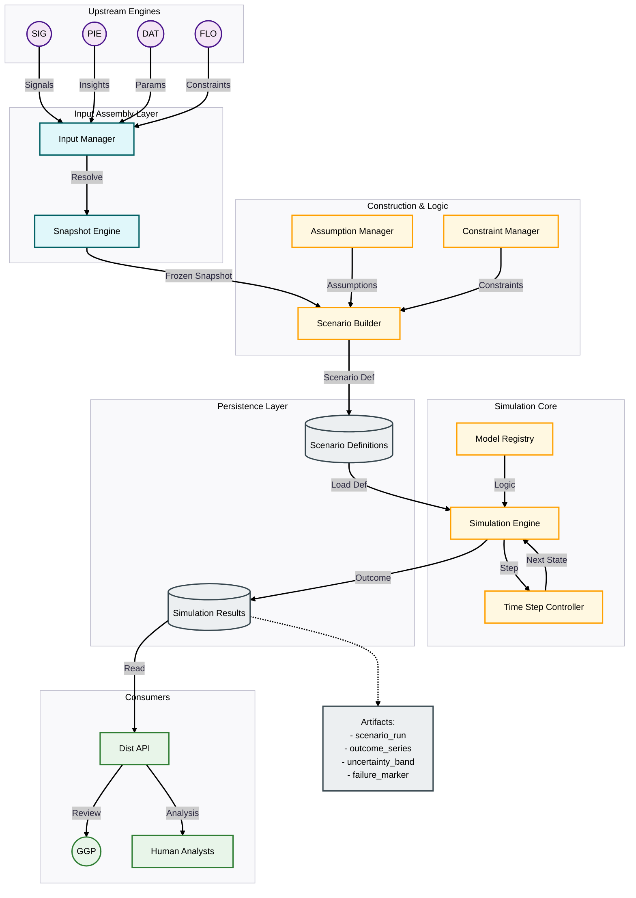

# SIM Internal Architecture Diagram

```mermaid
---
    config:
      theme: redux
---
graph TD
    %% -- Styles --
    classDef input fill:#e0f7fa,stroke:#006064,stroke-width:2px,color:#000000;
    classDef logic fill:#fff8e1,stroke:#ffa000,stroke-width:2px,color:#000000;
    classDef store fill:#eceff1,stroke:#37474f,stroke-width:2px,color:#000000;
    classDef output fill:#e8f5e9,stroke:#2e7d32,stroke-width:2px,color:#000000;
    classDef ext fill:#f3e5f5,stroke:#4a148c,stroke-width:2px,color:#000000;

    %% -- 1. Input Assembly --
    subgraph Assembly [Input Assembly Layer]
        InputMgr[Input Manager]:::input
        SnapshotEng[Snapshot Engine]:::input
    end

    %% -- 2. Construction & Logic --
    subgraph Construction [Construction & Logic]
        ScenarioBldr[Scenario Builder]:::logic
        AssumptionMgr[Assumption Manager]:::logic
        ConstraintMgr[Constraint Manager]:::logic
    end

    %% -- 3. Simulation Execution --
    subgraph Execution [Simulation Core]
        SimEngine[Simulation Engine]:::logic
        TimeStepper[Time Step Controller]:::logic
        ModelRegistry[Model Registry]:::logic
    end

    %% -- 4. Results & Persistence --
    subgraph Storage [Persistence Layer]
        DefStore[(Scenario Definitions)]:::store
        ResultStore[(Simulation Results)]:::store
    end

    %% -- 5. External Inputs --
    subgraph Upstream [Upstream Engines]
        SIG((SIG)):::ext
        PIE((PIE)):::ext
        DAT((DAT)):::ext
        FLO((FLO)):::ext
    end

    %% -- 6. Consumers --
    subgraph Downstream [Consumers]
        GGP((GGP)):::output
        Humans[Human Analysts]:::output
        API[Dist API]:::output
    end

    %% -- Data Flow --

    %% Ingestion
    SIG -- "Signals" --> InputMgr
    PIE -- "Insights" --> InputMgr
    DAT -- "Params" --> InputMgr
    FLO -- "Constraints" --> InputMgr

    %% Assembly
    InputMgr -- "Resolve" --> SnapshotEng
    SnapshotEng -- "Frozen Snapshot" --> ScenarioBldr

    %% Definition
    AssumptionMgr -- "Assumptions" --> ScenarioBldr
    ConstraintMgr -- "Constraints" --> ScenarioBldr
    ScenarioBldr -- "Scenario Def" --> DefStore

    %% Execution
    DefStore -- "Load Def" --> SimEngine
    ModelRegistry -- "Logic" --> SimEngine
    SimEngine -- "Step" --> TimeStepper
    TimeStepper -- "Next State" --> SimEngine

    %% Persistence
    SimEngine -- "Outcome" --> ResultStore

    %% Output
    ResultStore -- "Read" --> API
    API -- "Review" --> GGP
    API -- "Analysis" --> Humans

    %% Detailed Models (Notes)
    ResultStore -.-> Models["Artifacts:<br/>- scenario_run<br/>- outcome_series<br/>- uncertainty_band<br/>- failure_marker"]:::store
```
